

## About Me

Software Engineer and Technical Support Engineer with 2.5 years of combined hands-on experience in software development, web application development, database systems, and technical support.

- 💼 Technical Support Engineer at **YemenSoft**
- 💻 Building web applications with **JavaScript, TypeScript, React, Next.js, PHP, Python, and FastAPI**
- 🗄️ Working with **Oracle Database, MySQL, PostgreSQL, MongoDB, SQL, and PL/SQL**
- 🛠️ Supporting ERP, accounting, and business management systems
- 🔍 Diagnosing application, database, reporting, Windows, and connectivity issues
- 🎨 Designing responsive interfaces using **Figma and Adobe XD**
- 📍 Based in Yemen
- 📫 **alshamimohammed90@gmail.com**

## Technical Skills

<table>
<tr>
<td width="33%" valign="top">

### Programming Languages

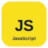
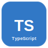
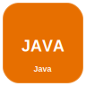
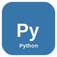
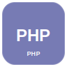
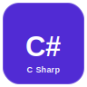

</td>
<td width="33%" valign="top">

### Front-End Development

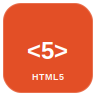
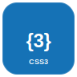
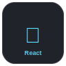
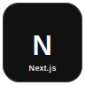
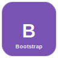
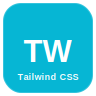

</td>
<td width="33%" valign="top">

### Back-End Development

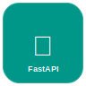

</td>
</tr>

<tr>
<td width="33%" valign="top">

### Databases

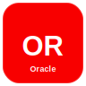
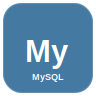
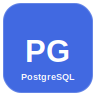

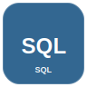
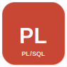

</td>
<td width="33%" valign="top">

### Development and Design Tools

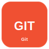

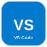
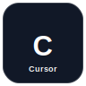
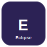
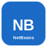
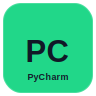
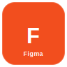
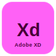

</td>
<td width="33%" valign="top">

### Technical Support

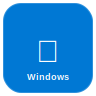

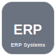
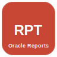
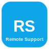

</td>
</tr>
</table>

## Oracle and ERP Experience

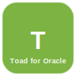

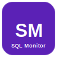

- ERP, accounting, and business management system support
- Oracle Database and PL/SQL troubleshooting
- Report customization using Oracle Reports Builder
- Troubleshooting packages, procedures, functions, and triggers
- SQL monitoring and application error analysis
- Windows, printer, Remote Desktop, file-sharing, and connectivity support

## Featured Projects

### GSLMS — Graduate Student Lifecycle Management System

A web application for managing graduate students, supervisors, administrators, academic milestones, requests, documents, notifications, and audit logs.

**Technologies:** PHP, MySQL, JavaScript, Tailwind CSS, Apache

[View Repository](https://github.com/MohammedFaisal0/GSLMS)

### Writer Brain — AI-Powered Creative Writing Platform

An AI-powered platform that helps children write stories, generate prompts, analyze story content, and create images.

**Technologies:** Next.js, FastAPI, Python, PostgreSQL, Groq API, Hugging Face

### Onyx Pro ERP Annual Closing Guide

An interactive Arabic web guide for the annual closing process in Onyx Pro ERP Version 8.

**Technologies:** HTML5, CSS3, JavaScript, GitHub Pages

[View Repository](https://github.com/MohammedFaisal0/Onyx_Closing_Guide)

## Connect with Me

- **Email:** [alshamimohammed90@gmail.com](mailto:alshamimohammed90@gmail.com)
- **GitHub:** [MohammedFaisal0](https://github.com/MohammedFaisal0)
- **LinkedIn:** Add your LinkedIn profile URL here
